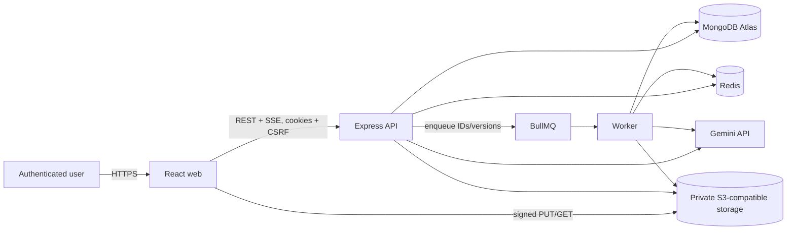
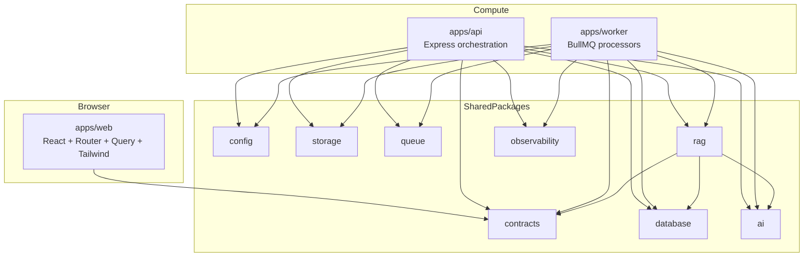
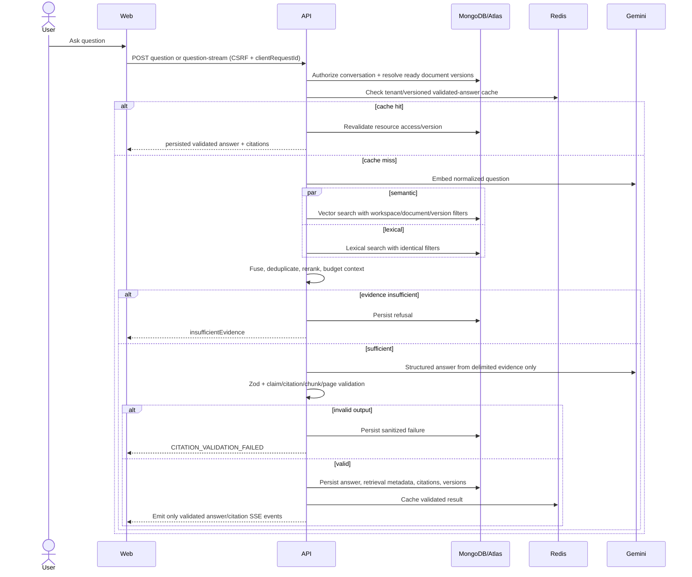
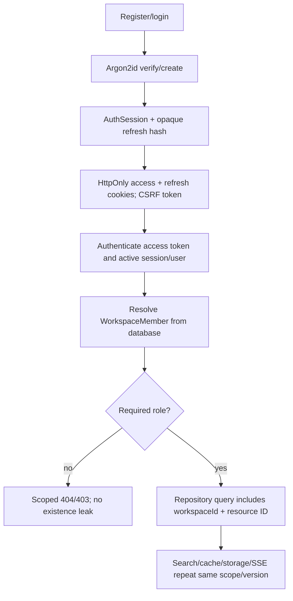

# Ask-PDF Architecture and Dependency Map

## Baseline

The architecture implements ADR-0001: three independently scalable applications, shared typed packages, MongoDB durable state/search, Redis/BullMQ transient job infrastructure, private S3-compatible PDFs, and Gemini adapters. Every boundary validates with Zod and carries a correlation ID.

## System context



## Container/service view



## PDF ingestion sequence

```mermaid
sequenceDiagram
  actor User
  participant Web
  participant API
  participant S3 as Object storage
  participant DB as MongoDB
  participant Q as BullMQ/Redis
  participant Worker
  participant Gemini

  User->>Web: Select PDF(s)
  Web->>API: POST /uploads/intents
  API->>DB: Authorize workspace + create UploadIntent
  API-->>Web: Short-lived signed PUT
  Web->>S3: Direct upload with checksum metadata
  Web->>API: POST /uploads/{intentId}/complete
  API->>S3: HEAD + bounded signature read
  API->>DB: Deduplicate; create Document + ProcessingRun
  API->>Q: enqueue documentId + processingVersion
  API-->>Web: 201 queued
  Worker->>DB: Re-read scope/version; acquire run
  Worker->>S3: Stream to reserved bounded temp file
  loop Page batches
    Worker->>Worker: validate/extract/normalize/checkpoint
  end
  Worker->>Worker: deterministic chunking
  loop Bounded embedding batches
    Worker->>Gemini: embed batch
    Worker->>DB: bulk upsert versioned chunks
  end
  Worker->>DB: completeness/index visibility check; mark ready
  Worker->>Q: complete job
  Worker-->>Web: authorized progress through API SSE
```

### Ingestion resource controls

- Direct upload: API never proxies the binary. Signed URLs are scoped, private, and expire after 900 seconds (**confirmed**).
- Validation: browser checks are advisory. API verifies declared size/checksum metadata and `%PDF-` signature through a bounded read; the worker repeats signature validation and performs the full parse.
- Duplicate handling: `{workspaceId, sha256, deletedAt:null}` lookup. Same-workspace duplicates return the existing document or an explicit duplicate choice; cross-workspace existence is never disclosed.
- Temp storage: reserve at most 157,286,400 bytes/job (**confirmed**), stream to a randomized job directory, monitor actual bytes, and delete in `finally`.
- Extraction: page-by-page, grouped into batches of 10 (**confirmed**); destroy PDF.js page resources after use; cap 500 pages, 10,000,000 extracted characters, and 1,800 seconds (**confirmed**).
- Checkpoints: durable run stores completed stage, extracted page count, expected/stored chunk counts, and versions. Derived page-batch artifacts may be stored in a run-scoped temp/checkpoint object prefix when resumption cost warrants it; they are never authoritative after the run closes.
- Resume: repeat pure stages deterministically; skip chunk embeddings whose stable ID/content hash/model/dimension already match; stale runs cannot update the document.
- Backpressure: pause fetching new jobs when process memory/temp reservation/provider semaphore/queue-depth thresholds are exceeded. API still accepts uploads only within workspace quotas and can return 429/503 with `Retry-After`.
- Priority: proposed priority classes are user retry=1, new upload=5, maintenance reindex=10. Prevent starvation with an age threshold and validate numeric semantics against the pinned BullMQ release.
- Dead-letter: deterministic/non-retryable failures become durable failed runs immediately. Exhausted retryable jobs remain in BullMQ's capped failed set (5,000 confirmed) and MongoDB for operator review; no separate broker is introduced.

## RAG query and citation-safe stream sequence



### Retrieval and accuracy controls

- Deterministic chunk ID: SHA-256 of document ID, processing version, page span/source offsets, ordinal, and content hash.
- Chunking: target 650, maximum 800, overlap 100 tokens (**confirmed**), retaining headings and exact page/source spans.
- Candidate bounds: 20 vector + 20 lexical, fused to 20, context <= 8 chunks and <= 7,000 tokens (**confirmed**).
- Fusion: reciprocal rank fusion with versioned weights; deduplicate by stable ID and high source-span/content overlap. Initial lightweight deterministic reranking uses normalized retrieval ranks plus exact-term/heading/page diversity features. A learned reranker is deferred.
- Evidence gate: `MIN_EVIDENCE_SCORE=0.35` is a **confirmed configuration value but an unevaluated threshold**. It cannot be treated as probability; calibration is a release gate.
- Citation validation: each claim ID must reference a retrieved chunk from the authorized ready version; page must exist in `sourceSpans`; excerpt must normalize to a substring of the cited source; every factual claim must be covered.
- Conflicts: represent opposing claims separately, cite both sources, and state uncertainty; never silently choose.
- Prompt injection: evidence is delimited/untrusted; document instructions have no authority; generation has no tools or external access.

## Authentication and authorization flow



- Access token claims include issuer, audience, subject, and session ID; refresh rotation creates a replacement record and detects reuse.
- Mutations require session-bound CSRF except unauthenticated register/login and direct signed-storage PUT.
- UI guards are navigation only. Server authorization is repeated at resource, search, stream, cache, and signed URL boundaries.

## Module boundaries and dependency direction

| Module                   | Owns                                                                        | May depend on                           | Must not own/import                                    |
| ------------------------ | --------------------------------------------------------------------------- | --------------------------------------- | ------------------------------------------------------ |
| `apps/web`               | routes, UI state, upload orchestration, SSE/PDF viewer                      | browser-safe contracts/client utilities | DB, Redis, BullMQ, S3 credentials, Gemini              |
| `apps/api`               | HTTP/SSE, authz, orchestration, DTO mapping                                 | packages                                | worker app; provider logic in routes                   |
| `apps/worker`            | processors, stages, shutdown, resource control                              | packages                                | API app; trust in payload ownership                    |
| `packages/contracts`     | Zod boundary schemas/types                                                  | browser-safe libraries only             | Express/Mongoose/BullMQ/fs/provider SDKs               |
| `packages/config`        | one-time environment parsing/frozen config                                  | Zod                                     | product logic; scattered `process.env` reads elsewhere |
| `packages/database`      | connections, models, indexes, repositories                                  | domain/contracts as designed            | HTTP DTO ownership; network work in hooks              |
| `packages/storage`       | provider-neutral private object operations                                  | AWS S3-compatible SDK internally        | auth decisions without supplied scope                  |
| `packages/queue`         | names, payloads, factories, retry/dedup defaults                            | contracts/config/observability          | business processing                                    |
| `packages/ai`            | embedding/generation interfaces, Gemini adapter, usage/errors               | contracts/config                        | RAG policy; direct consumers of SDK elsewhere          |
| `packages/rag`           | normalization, chunking, retrieval, ranking, prompts, citations, evaluation | contracts, AI/database interfaces       | Express/React/provider SDK details                     |
| `packages/observability` | logger, correlation context, metrics/tracing                                | config                                  | business logic or high-cardinality labels              |

Allowed direction: `apps/* -> packages/*`; application services -> domain; infrastructure implementations -> domain interfaces; RAG orchestration -> AI/database/contracts. No package -> app import, no app -> sibling app import, no circular dependency.

## Database ownership

| Collection                               | Owner module               | Tenant rule                           | Critical indexes/invariants                                         |
| ---------------------------------------- | -------------------------- | ------------------------------------- | ------------------------------------------------------------------- |
| `users`                                  | auth/database              | global identity                       | unique case-insensitive email; hash excluded                        |
| `workspaces`, `workspace_members`        | auth/database              | membership gate                       | owner membership matches `ownerId`; unique workspace/user           |
| `auth_sessions`                          | auth/database              | by user/session                       | refresh hash unique; expiry TTL; rotation chain                     |
| `upload_intents`                         | uploads/database           | `workspaceId` + requester             | object key unique; expiry/diagnostic TTL; one document max          |
| `documents`                              | documents/database         | `workspaceId`, `deletedAt:null`       | SHA-256 duplicate lookup; ready version invariant                   |
| `document_processing_runs`               | worker/database            | `workspaceId` + document/version      | unique document/version and job ID; monotonic stage                 |
| `document_chunks`                        | RAG/database               | filters inside search                 | stable chunk unique; embedding hidden; model/dimension match        |
| `document_collections`                   | collections/database       | `workspaceId`, not deleted            | all document IDs same workspace; active name uniqueness             |
| `conversations`, `messages`, `citations` | conversations/RAG/database | `workspaceId` through every predicate | immutable selection snapshot; idempotent reply; citations validated |
| `audit_events`                           | observability/security     | `workspaceId`                         | append-only, allow-listed metadata, no update/delete API            |

## Queue names, payloads, and ownership

| Queue                            | Producer                             | Consumer               | Validated payload                                                                              | Deduplication / retry                                                                                    |
| -------------------------------- | ------------------------------------ | ---------------------- | ---------------------------------------------------------------------------------------------- | -------------------------------------------------------------------------------------------------------- |
| `documents.ingest.v1`            | upload/reprocess application service | ingestion worker       | `{documentId, processingVersion, requestedByUserId, reason, correlationId}`; IDs/versions only | job ID `documentId:processingVersion`; 3 attempts; exponential 2s base+jitter; worker reauthorizes state |
| `documents.delete.v1`            | authorized delete service            | deletion worker        | `{documentId, deletionVersion, requestedByUserId, correlationId}`                              | job ID `delete:documentId:deletionVersion`; idempotent object/chunk/cache cleanup                        |
| `learning.artifacts.generate.v1` | future learning service              | future learning worker | `{artifactId, workspaceId, sourceSnapshotVersion, artifactVersion, correlationId}`             | Deferred; no evidence text in payload                                                                    |

Payload ownership lives in `packages/contracts`; queue names/retry/dedup factories live in `packages/queue`; business logic lives in application/worker/RAG modules.

## Redis/cache key strategy

All keys begin with the configured `REDIS_KEY_PREFIX` (`askpdf:{environment}` conceptually), include workspace scope, use hashes rather than raw questions, and have bounded TTL/payloads.

```text
askpdf:{env}:tenant:{workspaceId}:job:{documentId}:{processingVersion}:progress
askpdf:{env}:tenant:{workspaceId}:job:{documentId}:{processingVersion}:cancel
askpdf:{env}:tenant:{workspaceId}:rate:{operation}:{principalHash}:{window}
askpdf:{env}:tenant:{workspaceId}:qemb:{embeddingModel}:{normalizedQuestionHash}
askpdf:{env}:tenant:{workspaceId}:answer:{questionHash}:{documentVersionSetHash}:{embeddingModel}:{retrievalVersion}:{promptVersion}
askpdf:{env}:tenant:{workspaceId}:lock:{operation}:{resourceId}:{version}
```

- Cache only schema- and citation-validated results.
- Reauthorize resources before serving a hit.
- Document reprocess/access/deletion changes bypass old keys through version/access changes and schedule targeted cleanup.
- Redis failure falls back to source-of-truth execution; it may disable queue-dependent mutations/progress history but never invent state.

## Failure, retry, cancellation, and graceful degradation

| Dependency/failure                   | Behavior                                                                                     | Retry/fallback                                                                            | User-visible result                                                  |
| ------------------------------------ | -------------------------------------------------------------------------------------------- | ----------------------------------------------------------------------------------------- | -------------------------------------------------------------------- |
| MongoDB unavailable                  | API readiness fails; durable mutations/questions stop; worker does not proceed               | bounded reconnect/probe; no in-memory truth                                               | 503 `DEPENDENCY_UNAVAILABLE`; existing static UI remains usable      |
| Redis unavailable                    | no enqueue, rate-limit state, live history, or cache; durable document status still readable | GET document durable snapshot; resume when Redis returns                                  | 503 for queue-requiring mutations; progress polling/durable fallback |
| S3 unavailable                       | intents/confirmation/view/download fail safely                                               | bounded idempotent retry; no document ready transition                                    | 503 storage error with retry                                         |
| Gemini embedding unavailable         | ingestion pauses/fails retryably                                                             | 3 job attempts; resume missing batches                                                    | processing retry state, then durable failure                         |
| Gemini generation unavailable        | no fabricated answer                                                                         | bounded adapter retry; cache hit only after reauthorization                               | 502 provider error; question remains retryable                       |
| Atlas search unavailable             | no global/unfiltered fallback                                                                | bounded retry; lexical-only degradation is disabled unless separately evaluated/approved  | 503 `SEARCH_UNAVAILABLE`                                             |
| Worker crash/duplicate               | deterministic rerun from checkpoint/version                                                  | upsert/skip complete batches; stale guard                                                 | progress reconnect; no duplicate chunks                              |
| Cancellation                         | API records request and signal                                                               | worker checks between pages/batches/stages and cleans temp data                           | durable `cancelled`; reprocess available                             |
| Malformed/encrypted/pathological PDF | terminate as non-retryable                                                                   | no automatic retry until input/config changes                                             | safe `PROCESSING_REJECTED` code/message                              |
| Invalid model citations              | discard model answer                                                                         | optional bounded regeneration only if explicitly configured; never persist invalid result | `CITATION_VALIDATION_FAILED`, no answer text                         |

## Third-party service boundaries

- Gemini: server-side API key only; timeouts, retry mapping, structured output validation, token accounting, model/version metadata, no document authority.
- MongoDB Atlas: TLS/managed credentials, explicit vector/lexical index versions, tenant filters in pipelines, gated integration test credentials separated from production.
- Redis: authenticated/TLS managed endpoint in production; BullMQ-compatible eviction policy; bounded cached content.
- S3/R2/MinIO: private buckets, randomized keys, least-privilege credentials, CORS limited to intended origins/actions, lifecycle/abort cleanup, short-lived signed URLs.
- Sentry/OTel (optional): redacted bounded metadata only; no raw documents/questions/answers or credentials.
- ClamAV (optional): pre-parse malware gate when enabled; timeout/failure policy must be explicit and fail closed in production if configured as mandatory.
